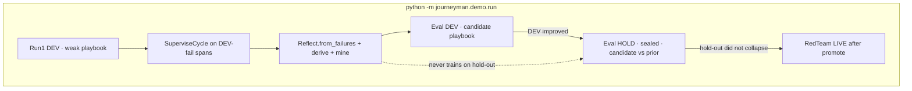

# Journeyman


Journeyman is a self-improving agent for a task family it has never seen before: **readonly GitHub repo triage**. It starts with an empty playbook, calls official GitHub MCP tools against a frozen fixture repo, scores itself on a sealed eval, mines rules from failures and corpus soil, then re-runs. Promote happens only when DEV improves **and** a hold-out split that never trained the playbook does not collapse.

The Python package `journeyman/` is the source of truth. The Vite shell is an artifact reader plus a thin HTTP client. It does not contain a second learning loop.

| | |
|---|---|
| Task family | label, owner, duplicate, summarize, which PR closed an issue |
| World | [`arjun7n9s/journeyman-fixture`](https://github.com/arjun7n9s/journeyman-fixture) |
| Tools | GitHub MCP readonly · `https://api.githubcopilot.com/mcp/readonly` |
| Eval | frozen `eval/dev.json` (14) + sealed `eval/holdout.json` (7) |
| Cheap chat | TensorMux `glm-4-7-flash` |
| Escalate | OpenAI `gpt-5-nano` after a **logged** quality-gate miss |
| Embed | `text-embedding-3-small` via `CostRouter.embed_route` (not a child of chat) |
| Traces | Neatlogs ingest `POST https://ingest.neatlogs.com/v1/trace` |

`--mode` on the CLI and HTTP API branches **only** at Chat / GitHub MCP / Neatlogs IO. Actor, Reflect, mine, promote, and hold-out sealing are the same pipeline offline and live.

## How the loop works



1. **Load frozen challenge.** DEV cases train and score the candidate. Hold-out cases are not scored and never enter `TraceIngest` training.
2. **Run1 DEV.** `Actor.run` on each DEV task with playbook `weak-0`. The actor uses one generic evidence plan (CONTRIBUTING, CODEOWNERS, issues, PRs, labels) plus issue/PR/path when the question names them. It does not switch on `task_type`.
3. **SuperviseCycle** (pre-promote, candidate only): ingest → diagnose → causal analysis → probe → aux LiveScorer → prompt patch → exact replay → postmortem. LiveScorer is **not** the promote signal.
4. **Reflect.** Merges a diffable playbook from DEV-fail spans. **Derive** compiles documented `condition → outcome` lines from CONTRIBUTING.md and CODEOWNERS into ACTIVE rules. **Mine** induces CANDIDATE rules from issues labeled `corpus:mine` (coverage / confidence / lift). The miner never opens `corpus/HIDDEN.md`.
5. **Eval DEV.** Actor re-run on frozen DEV with the candidate playbook. This is the promote signal.
6. **Sealed hold-out.** Only if DEV improved: score prior vs candidate on hold-out. Promote iff candidate hold-out ≥ prior. Ingest still ignores hold-out spans.
7. **RedTeam** (`verify.attack_live`) runs after promote on LIVE only.
8. Flush one nested Neatlogs tree. Persist playbook JSON, journal, version pointer, `runs/last.json`, and `web/public/last-report.json`.

Rollback restores the prior pointer: `python -m journeyman.demo.run --rollback --work-root <dir>` or `POST /api/rollback`.

### Invariants

- Hold-out never trains the playbook or journal.
- Challenge / `/api/challenge` cannot append to hold-out.
- OpenAI chat never appears unless a gate miss is logged.
- Production modules must not contain the hidden-convention marker from `corpus/HIDDEN.md`.
- Root TypeScript is not a second CostRouter or SuperviseCycle.

## Repository layout

```
journeyman/          Python runtime (contracts, Actor, rules, demo, HTTP API)
eval/                Frozen DEV + hold-out JSON
corpus/              Mining soil (HIDDEN.md is sealed — do not hardcode)
web/                 Vite UI — reads last-report.json, calls /api/*
architecture.md      Locked partner graph + module map
SPEC.md              Fixture world, policy allowlist, eval schema
.env.example         Partner keys (copy to local .env — never commit)
```

| Module | Role |
|---|---|
| `runtime.actor.Actor` | Cheap-first hops, gated MCP tools, traced every hop |
| `runtime.SuperviseCycle` | Failure → patch candidate (aux scores only) |
| `rules.derive` / `rules.mine` | Documented rules vs induced corpus rules |
| `reflect.Reflect` | Diffable playbook merge from DEV-fail spans |
| `spend.CostRouter` | Cheap chat first; embed is a separate route |
| `partners.mcp.GithubMcp` | Official GitHub MCP readonly (SSE JSON-RPC) |
| `partners.sink.NeatlogsTraceSink` | Nested tree → ingest.neatlogs.com |
| `demo.run` | CLI that executes the whole graph |
| `server.app` | FastAPI wrapper: health, report, run, challenge, rollback |

## HTTP API

`python -m journeyman.server` (default `127.0.0.1:8787`). Vite proxies `/api` there.

| Method | Path | What it does |
|---|---|---|
| `GET` | `/api/health` | Liveness + which partner keys are present (booleans only) |
| `GET` | `/api/report` | Latest `runs/last.json` |
| `POST` | `/api/run` | Full frozen loop `{ "challenge_id": "frozen", "mode": "offline" \| "live" }` |
| `POST` | `/api/challenge` | One freeform task through the **active** playbook |
| `POST` | `/api/rollback` | Swap active ↔ prior version pointer |

`/api/challenge` is how judges hand the agent a task it has not seen. It uses the same `Actor` and the playbook written by the last promote.

## UI

```bash
npm install
npm run dev
```

Opens the Vite shell (default `http://127.0.0.1:5173/`). Surfaces: Overview (measured gain + try-it console), Learning, Trace, Promote. The try-it console posts to `/api/challenge`. Open cockpit rewrites stale `/?trace_id=` links to `https://app.neatlogs.com/traces/{id}`.

The UI never reimplements Actor, Reflect, or promote.

## Run

### Offline (same pipeline, MCP/chat doubles)

```bash
cd journeyman
python -m pip install -e ".[dev]"
python -m pytest
python -m journeyman.demo.run --challenge frozen --mode offline --work-root ../.tmp-ui
```

Or from the repo root, with the API + UI:

```bash
python -m pip install -e "journeyman/[dev]"
npm install
npm run dev          # API :8787 + Vite
# UI: Run learning loop  or  POST /api/run
```

Expected shape on a healthy offline frozen run: Run1 DEV is weak; Reflect + mine write fixture-specific rules; RunN DEV rises; hold-out is scored only at promote and must not collapse.

### Live

Copy `.env.example` → `.env` (never commit it). Required:

| Variable | Partner |
|---|---|
| `TMX_API_KEY` | TensorMux cheap chat |
| `OPENAI_API_KEY` | Escalate + embeddings |
| `GITHUB_TOKEN` | GitHub MCP readonly |
| `NEATLOGS_API_KEY` | Ingest bearer |
| `NEATLOGS_PROJECT_ID` | Trace project name (default `journeyman`) |
| `NEATLOGS_BASE_URL` | `https://ingest.neatlogs.com` |
| `NEATLOGS_ORG_ID` / `NEATLOGS_DASHBOARD_PROJECT_ID` | Cockpit deep link |

```bash
python -m journeyman.demo.run --challenge frozen --mode live --work-root /tmp/jm-live
```

Live pytest (`pytest -m live`) is skipped unless those keys are present. A redacted small-path transcript is in [`docs/LIVE_SMOKE.md`](docs/LIVE_SMOKE.md).

## Eval and policy

Frozen tasks live in `eval/dev.json` and `eval/holdout.json` against `arjun7n9s/journeyman-fixture`. The actor may only use the readonly GitHub MCP allowlist (issues, PRs, labels, `CONTRIBUTING.md`, `CODEOWNERS`, files under `src/`). Writes, secrets, workflows, and hold-out mutation are denied.

See [`SPEC.md`](SPEC.md) for the fixture world (issues I1–I18, PRs, label taxonomy) and [`architecture.md`](architecture.md) for the partner graph and code map.

## Tests

```bash
cd journeyman && python -m pytest -q
npx vitest run tests/reportView.test.ts
```

Python covers contracts, generic tool planning, mining (synthetic corpus only), sealed hold-out, offline demo promote, HTTP API, and partner URL/auth shapes. Vitest covers report presentation (human lessons, cockpit URL rewrite).

## License

Private hackathon build. Keys stay in local `.env`.
