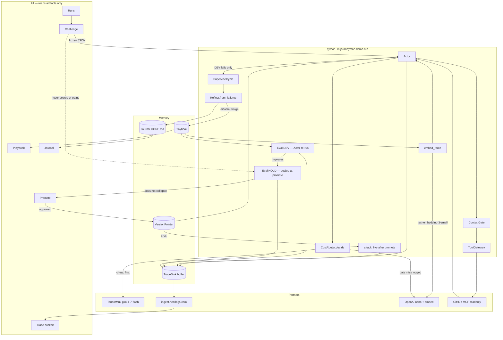

# Journeyman architecture

Python package `journeyman/` is the source of truth. Keys stay in local `.env`. Never paste keys into chat.

This file is the running system, not a wishlist. Every box below has a module. The CLI that executes the whole graph is:

```bash
python -m journeyman.demo.run --challenge frozen --mode offline
python -m journeyman.demo.run --challenge frozen --mode live
```

`--mode` branches **only** at Chat / GitHub MCP / Neatlogs IO. The pipeline above that is shared.

| Pin | Value |
|---|---|
| Product | `journeyman/` (`journeyman.contracts` = only shapes) |
| Task family | repo triage / grounding |
| World | `arjun7n9s/journeyman-fixture` |
| Eval | `eval/dev.json` (10) + `eval/holdout.json` (6) |
| App | official GitHub MCP readonly `https://api.githubcopilot.com/mcp/readonly` |
| Cheap brain | TensorMux `https://api.tensormux.com/v1` / `glm-4-7-flash` / `TMX_API_KEY` |
| Escalate | same hop → `gpt-5-nano` / `https://api.openai.com/v1` / `OPENAI_API_KEY` after a **logged** quality-gate miss |
| Embed | `text-embedding-3-small` via `CostRouter.embed_route` + `ChatClient.embed` — never a child of chat |
| Trace SoR | Neatlogs ingest `https://ingest.neatlogs.com` `POST /v1/trace` `Authorization: Bearer` |
| Cockpit | `https://app.neatlogs.com` |
| UI | artifact reader (`runs/last.json` / `ui/index.html` / Vite `last-report.json`) — does **not** run the loop |
| Skip v1 | Smallest.ai voice, Dodo, `JOURNEYMAN_GITHUB_REST` except as an escape hatch |



## What `run_demo` actually does

1. Load frozen challenge (`evalset.frozen.load_frozen_eval`) — 10 DEV, 6 hold-out, repo `arjun7n9s/journeyman-fixture`.
2. **Run1 DEV only.** `Actor.run` on each DEV case with the weak playbook. Hold-out is not scored. `TraceIngest` skips `session_id=="test"`, `prompt_variant=="candidate"`, `split=holdout`, tool-child spans.
3. **SuperviseCycle** (pre-promote, candidate only):  
   `TraceIngest.poll` → `FailureJudge.diagnose` → skip if not failure → `CausalAnalyst.analyze` → `ProbeFactory.synthesize` → resolve baseline → `LiveScorer` **aux** → `PromptSurgeon.propose` → `LiveScorer` aux candidate → `ExactReplay.replay` → persist postmortem.  
   LiveScorer is **not** the promote signal.
4. **Reflect.from_failures** merges a diffable playbook from DEV-fail spans + RAG (`embed_route`). Appends a journal lesson. Hold-out spans never enter this merge.
5. **Eval DEV (promote signal):** Actor re-run on the 10 frozen DEV tasks with the candidate playbook.
6. **Sealed hold-out (only if DEV improved):** Actor re-run of the 6 hold-out tasks on **prior active** and **candidate**. Promote iff candidate hold-out ≥ prior. Ingest still ignores hold-out spans.
7. **RedTeam on LIVE** (`verify.attack_live`) only after promote. Adversarial prefixes, Actor re-run, traces to Neatlogs.
8. Flush one nested Neatlogs tree. Persist playbook JSON, scripts, and `versions/pointer.json`. `--rollback` restores prior. Write `runs/last.json`, `ui/index.html`, journal, diff. UI tabs read that artifact.

Live GitHub MCP is JSON-RPC over SSE (`initialize` + `Mcp-Session-Id` + `tools/call`). Chat/MCP HTTP retries timeouts.

## Code map

| Graph box | Module |
|---|---|
| Actor | `journeyman.runtime.actor.Actor` |
| Cost router | `journeyman.spend.CostRouter.decide` / `embed_route` |
| Context gates | `journeyman.runtime.ContextGate` |
| Policy | `journeyman.policy.ToolGateway` + `policy/github_readonly.yaml` |
| GitHub MCP | `journeyman.partners.mcp.GithubMcp` |
| SuperviseCycle | `journeyman.runtime.SuperviseCycle` |
| Reflect + RAG | `journeyman.reflect.Reflect` |
| Patch | `journeyman.patch.PromptSurgeon` |
| Budget | `journeyman.evolve.BudgetedEvolver` |
| Eval DEV / Hold | `journeyman.demo.run.score_split` + `evalset.frozen` |
| RedTeam LIVE | `journeyman.verify.attack_live` |
| Journal | `journeyman.journal.JournalStore` |
| Traces → NL | `journeyman.partners.sink.NeatlogsTraceSink` |
| Chat cheap/escalate | `journeyman.partners.chat.ChatClient` |
| CLI + promote | `journeyman.demo.run` |
| UI | `journeyman.demo.ui` + `web/src/App.tsx` (readers) |

## Partner rules

| Partner | Role | Not for |
|---|---|---|
| **TensorMux** | Default Actor / Reflect / Patch / RedTeam chat (`glm-4-7-flash`). | Embeddings |
| **Neatlogs** | SoR. Ingest `https://ingest.neatlogs.com` `POST /v1/trace` Bearer `nlw_…`. Field `project` = `NEATLOGS_PROJECT_ID` (name, default `journeyman`). Dashboard `https://app.neatlogs.com`. Path: Actor / Reflect / Patch / RedTeam / Eval DEV / Eval Hold / Router → buffer → one tree → cockpit. | Replacing Runs scores; POST to `app.neatlogs.com` or `api.neatlogs.com`; `x-api-key` |
| **OpenAI** | One key, two calls. Chat escalate = `gpt-5-nano` after a logged gate miss on the **same** node. Embed = `text-embedding-3-small`. | Daily driver; a Nano box |
| **GitHub MCP** | Readonly tools (`issue_read`, `list_issues`, `list_label`, …). Frozen fixture repo. | Writes; REST unless `JOURNEYMAN_GITHUB_REST=1` |
| **Smallest / Dodo** | Optional keys in `.env`. Not boxes. | |

## Invariants

- Challenge never writes hold-out.
- Hold-out is scored only at promote (candidate vs prior active) and never trains playbook or journal.
- OpenAI chat never appears unless a gate miss is logged.
- RedTeam runs after promote on LIVE only.
- Root TypeScript is not a second loop.

## Locked UI surfaces

| Surface | Shows |
|---|---|
| Challenge | Frozen task in; MCP + active playbook |
| Runs | DEV vs hold-out, v0 vs vN, accuracy / cost / speed from traces |
| Trace | Neatlogs cockpit + local children from the flushed tree |
| Playbook | Active version + retrieved facts |
| Journal | Append-only lessons |
| Promote | DEV + hold-out headline; approved pointer or hold |
