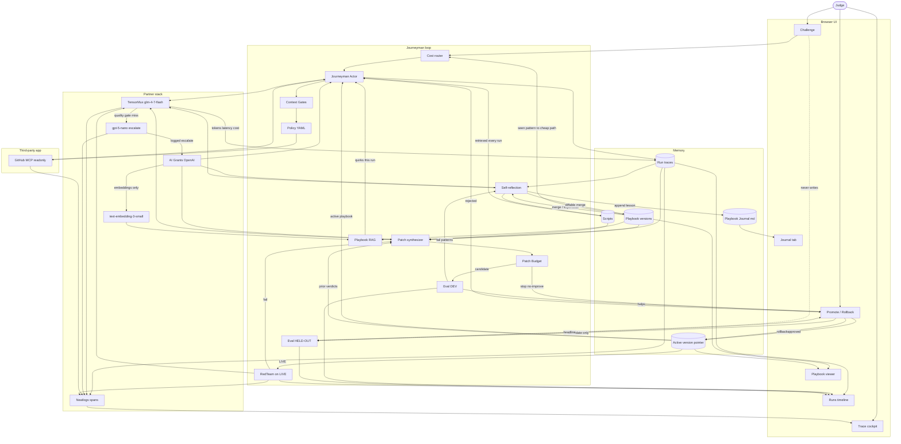

# Journeyman architecture (integrated)

Locked loop + partner stack. Keys live in local `.env` only. Never paste keys into chat.

- **Track:** Automated Agent Engineering
- **Task family:** repo triage / grounding on `arjun7n9s/journeyman-fixture`
- **Third-party app:** GitHub MCP readonly
- **Everyday brain:** TensorMux `https://api.tensormux.com/v1` / `glm-4-7-flash` / `TMX_API_KEY`
- **Trace SoR:** Neatlogs (`NEATLOGS_API_KEY`) — Trace cockpit reads this
- **Escalator + embeddings:** AI Grants OpenAI at `https://api.openai.com/v1` — `gpt-5-nano` on a logged quality-gate miss; `text-embedding-3-small` (ada-002 backup) for playbook RAG only
- **Skip v1:** Smallest.ai voice, Dodo infra, prize-credit boxes

## Partner rules

| Partner | Role | Not for |
|---|---|---|
| **TensorMux** | Daily Actor / Reflect / Patch / RedTeam model calls. Every call writes tokens, latency, rough $ into the run trace and a Neatlogs span. | Embeddings |
| **Neatlogs** | System of record for traces. Every tool hop and model call is a span: run id, challenge, version, role (`actor` / `reflect` / `patch` / `eval` / `redteam`), tool, success/error, timing, tokens, playbook hits. Fail → patch → replay = same run family, before and after. | Replacing Runs scores |
| **AI Grants OpenAI** | Escalator: `gpt-5-nano` only after a logged TensorMux quality-gate miss on Reflect, Patch, or a hard Actor step. Embeddings: playbook RAG. Base URL `https://api.openai.com/v1`. | Daily driver |
| **GitHub MCP** | The third-party app the agent learns. | Writes in DEV/hold-out |
| **Smallest.ai / Dodo** | Keys may exist in `.env`. Not architecture boxes in v1. | |

## Grafts

Router, Gates, Patch + Budget, RedTeam, Scripts, Journal, Rollback, TensorMux, Neatlogs, OpenAI escalate + embeddings.

## Build order

1. **Actor ↔ MCP ↔ Traces ↔ Neatlogs** — Challenge → router stub → actor → gates stub → policy → GitHub MCP. TensorMux flash for the actor. Every hop + model call is a Neatlogs span with tokens/latency/cost.
2. **Reflect → Playbook / Journal + RAG** — DEV traces → diffable playbook + journal lesson. Embeddings from OpenAI only. Next run retrieves playbook via RAG. Escalate Reflect to nano only on a logged gate miss.
3. **Eval DEV** — frozen 10-task DEV: accuracy / cost / speed. Runs shows v0 vs later. Eval spans in Neatlogs.
4. **Patch + Budget** — TensorMux proposes a candidate; N tries / no-improve stop. Escalate Patch to nano if weak. Do not promote a failing exhaust. Replay the same Neatlogs run family.
5. **Promote / held-out** — candidate-only sealed hold-out; approve / reject / rollback.
6. **Router / Gates / RedTeam polish** — cheap path on seen patterns; gates in front of policy; red-team on LIVE still traced in Neatlogs.

Invariant: Challenge never writes hold-out. Hold-out never trains playbook or journal. OpenAI never appears unless a gate miss is logged, except embeddings.

## Locked interfaces

| Surface | Shows |
|---|---|
| Challenge | Judge task in; MCP + active playbook/scripts |
| Runs | DEV vs hold-out, v0 vs vN, accuracy / cost / speed; later red-team rows. Cost comes from TensorMux/OpenAI traces. |
| Trace | Neatlogs cockpit: spans for tools and model calls, before/after a patch replay |
| Playbook | Active version + RAG-retrieved facts |
| Journal | Append-only reflection lessons |
| Promote / Rollback | DEV + hold-out headline; approve, reject, rollback |
