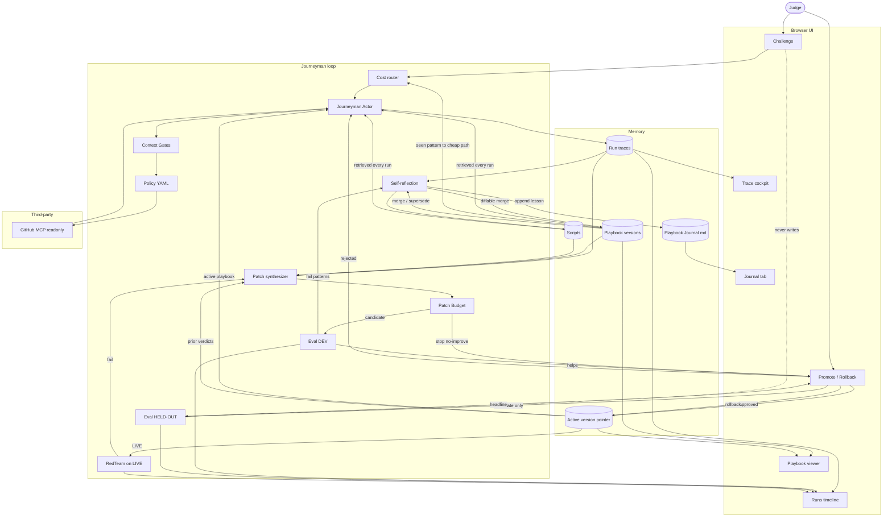

# Journeyman architecture (locked)

This is the **finalized** graph. Grafts are in. Implement in the build order below — do not skip ahead to polish boxes.

- **Track:** Automated Agent Engineering
- **Third-party (pinned):** GitHub official MCP, readonly for eval (`https://api.githubcopilot.com/mcp/readonly`)
- **Workspace:** `arjun7n9s/journeyman-fixture`
- **Task family:** repo triage / grounding
- **Metrics every run:** accuracy, cost (tools + tokens), speed (ms)

See [plans/SPEC.md](plans/SPEC.md) for tasks, policy, and eval splits.

## Grafts (locked in)

Router, Gates, Patch + Budget, RedTeam, Scripts, Journal, Rollback on Promote.

## Build order

Do not implement later stages before earlier ones work and can be shown.

1. **Actor ↔ MCP ↔ Traces** — Challenge hits actor; policy-gated GitHub MCP; every run writes a trace.
2. **Reflect → Playbook / Journal** — DEV traces become a diffable playbook version and an appended journal lesson. Next run retrieves playbook (and scripts when they exist).
3. **Eval DEV** — frozen 10-task DEV scores accuracy / cost / speed. Runs shows v0 vs later.
4. **Patch + Budget** — synthesizer proposes a candidate; N tries / no-improve stop. Do not promote a failing exhaust.
5. **Promote / held-out** — candidate-only sealed hold-out; approve activates version; rollback restores prior pointer.
6. **Router / Gates / RedTeam polish** — cheap path on seen patterns; context gates in front of policy; red-team on LIVE writes fails into Patch and Runs.

Invariant through every stage: Challenge never writes hold-out. Hold-out never trains playbook or journal.

## Locked interfaces

| Surface | Shows |
|---|---|
| Challenge | Judge task in; classify/answer via MCP + active playbook/scripts |
| Runs | DEV vs hold-out, v0 vs vN, three metrics; later red-team rows |
| Trace | Step-through tool spans, args, result, cost, latency |
| Playbook | Active version + facts learned from the fixture repo |
| Journal | Append-only lessons from reflection (markdown) |
| Promote / Rollback | DEV score + hold-out headline; approve, reject, rollback |
