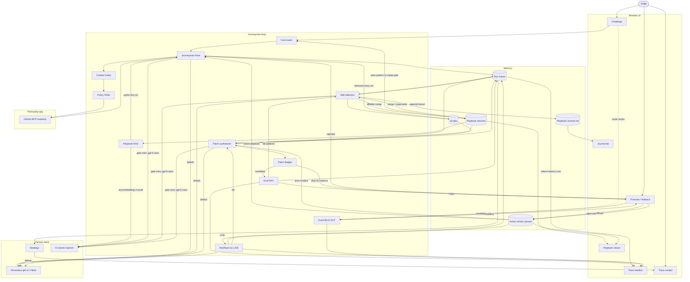

# Journeyman architecture (integrated)

Locked loop + partner stack. Keys live in local `.env` only. Never paste keys into chat.

- **Track:** Automated Agent Engineering
- **Task family:** repo triage / grounding on `arjun7n9s/journeyman-fixture`
- **Third-party app:** GitHub MCP readonly
- **Everyday brain:** TensorMux `https://api.tensormux.com/v1` / `glm-4-7-flash` / `TMX_API_KEY`
- **Trace SoR:** Neatlogs (`NEATLOGS_API_KEY`) — Trace cockpit reads this
- **OpenAI (one partner, two uses):** `https://api.openai.com/v1` + `OPENAI_API_KEY`. Chat escalate = `gpt-5-nano` after a logged TensorMux quality-gate miss. Embeddings = `text-embedding-3-small` (ada-002 backup) from the Embed/RAG node. Not a child of chat.
- **Skip v1:** Smallest.ai voice, Dodo infra, prize-credit boxes

## Partner rules

| Partner | Role | Not for |
|---|---|---|
| **TensorMux** | Default provider for Actor / Reflect / Patch / RedTeam (`glm-4-7-flash`). | Embeddings |
| **Neatlogs** | System of record. Universal path: **Actor / Reflect / Patch / RedTeam / Eval → Traces → NL → Trace cockpit**. Span fields: run id, challenge, version, role, tool, success/error, timing, tokens, playbook hits. Fail → patch → replay is the same run family. Judge opens Trace for the demo. | Replacing Runs scores |
| **AI Grants OpenAI** | One key, two calls. **Chat:** after a logged TensorMux quality-gate miss, the same Actor / Reflect / Patch node calls `gpt-5-nano`. **Embed:** Playbook RAG calls `text-embedding-3-small` (ada-002 backup). Base URL `https://api.openai.com/v1`. | Daily chat driver; a separate "Nano" service |
| **GitHub MCP** | The third-party app the agent learns. | Writes in DEV/hold-out |
| **Smallest.ai / Dodo** | Keys may exist in `.env`. Not architecture boxes in v1. | |

Every model call (TensorMux or OpenAI) still writes tokens, latency, and rough $ onto the **trace**, then into Neatlogs and the Runs timeline.

## Grafts

Router, Gates, Patch + Budget, RedTeam, Scripts, Journal, Rollback, TensorMux, Neatlogs, OpenAI (escalate + embeddings).

## Build order

1. **Actor ↔ MCP ↔ Traces ↔ Neatlogs** — Challenge → router stub → actor → gates stub → policy → GitHub MCP. TensorMux default. Every hop + model call: node → Traces → NL.
2. **Reflect → Playbook / Journal + RAG** — DEV traces → playbook + journal. Embed node → OpenAI embeddings. Escalate Reflect to `gpt-5-nano` only on a logged gate miss (same Reflect node).
3. **Eval DEV** — frozen 10-task DEV. Eval → Traces → NL. Runs shows v0 vs later.
4. **Patch + Budget** — TensorMux default; escalate Patch to nano on a logged miss. Replay the same Neatlogs run family.
5. **Promote / held-out** — candidate-only sealed hold-out; approve / reject / rollback.
6. **Router / Gates / RedTeam polish** — cheap path; gates; red-team still Actor-style: node → TMX (or nano) and node → Traces → NL.

Invariant: Challenge never writes hold-out. Hold-out never trains playbook or journal. OpenAI chat never appears unless a gate miss is logged.

## Locked interfaces

| Surface | Shows |
|---|---|
| Challenge | Judge task in; MCP + active playbook/scripts |
| Runs | DEV vs hold-out, v0 vs vN, accuracy / cost / speed. Cost from traces. |
| Trace | Neatlogs cockpit. Judge lands here for before/after a patch. |
| Playbook | Active version + RAG-retrieved facts |
| Journal | Append-only reflection lessons |
| Promote / Rollback | DEV + hold-out headline; approve, reject, rollback |
