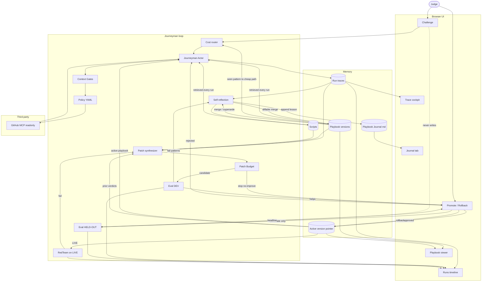

# Journeyman architecture (locked)

Canonical copy: [../architecture.md](../architecture.md)

This is the **finalized** graph. Grafts are in. Implement in the build order below — do not skip ahead to polish boxes.

- **Track:** Automated Agent Engineering
- **Third-party (pinned):** GitHub official MCP, readonly for eval (`https://api.githubcopilot.com/mcp/readonly`)
- **Workspace:** `arjun7n9s/journeyman-fixture`
- **Task family:** repo triage / grounding
- **Metrics every run:** accuracy, cost (tools + tokens), speed (ms)

See [SPEC.md](./SPEC.md) for tasks, policy, and eval splits.

## Grafts (locked in)

Router, Gates, Patch + Budget, RedTeam, Scripts, Journal, Rollback on Promote.

## Build order

1. Actor ↔ MCP ↔ Traces
2. Reflect → Playbook / Journal
3. Eval DEV
4. Patch + Budget
5. Promote / held-out
6. Router / Gates / RedTeam polish

Invariant: Challenge never writes hold-out. Hold-out never trains playbook or journal.
