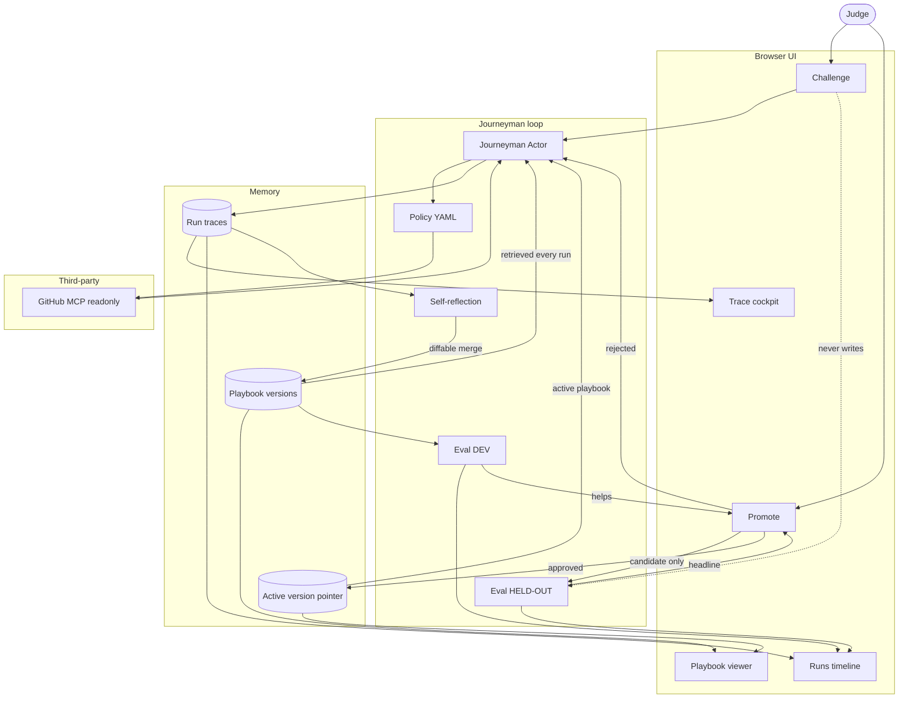

# Journeyman architecture (locked v1)

Canonical copy: [../architecture.md](../architecture.md)

This is the **locked** baseline. Add branches and integrations only as explicit follow-ups. Do not resurrect cut boxes (cost router, Context Gates, patch synthesizer, script library, red-team) unless a later note says so.

- **Track:** Automated Agent Engineering
- **Third-party (pinned):** GitHub official MCP, readonly for eval (`https://api.githubcopilot.com/mcp/readonly`)
- **Workspace:** `arjun7n9s/journeyman-fixture`
- **Task family:** repo triage / grounding
- **Metrics every run:** accuracy, cost (tools + tokens), speed (ms)

See [SPEC.md](./SPEC.md) for tasks, policy, and eval splits.

## Loop in words

1. Challenge hits the actor. The actor reads the **active playbook**, then Policy YAML, then GitHub MCP, then writes a **trace**.
2. After DEV work, reflection writes a **diffable playbook version**. The next run must retrieve it.
3. Frozen **Eval DEV** scores accuracy / cost / speed. If it helps, Promote may run **sealed hold-out**.
4. Approve activates the version pointer. Reject leaves the actor on the previous version.
5. Runs shows **v0 (empty playbook)** vs later versions. Hold-out never trains the playbook. Challenge never appends hold-out tasks.

## Intentionally not in v1

Cost router, Context Gates as a subsystem, patch synthesizer / patch budget product, script library, red-team cadence, rollback chrome beyond “activate this version.”

## Locked interfaces

| Surface | Shows |
|---|---|
| Challenge | Judge task in; classify/answer via MCP + playbook |
| Runs | DEV vs hold-out, v0 vs vN, three metrics |
| Trace | Step-through tool spans, args, result, cost, latency |
| Playbook | Active version + facts learned from the fixture repo |
| Promote | DEV score + hold-out headline; approve / reject |
