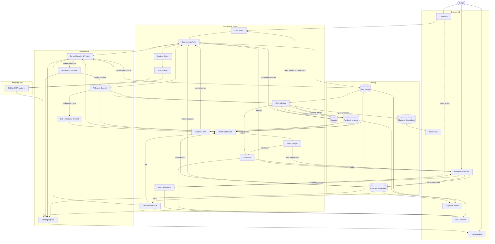

# Journeyman architecture (integrated)

Canonical copy: [../architecture.md](../architecture.md)

See the root file for partner rules, build order, and locked interfaces.

```mermaid
flowchart TB
  subgraph ui [Browser UI]
    Challenge[Challenge]
    Runs[Runs timeline]
    Trace[Trace cockpit]
    PlaybookUI[Playbook viewer]
    JournalUI[Journal tab]
    PromoteUI[Promote / Rollback]
  end

  subgraph brain [Journeyman loop]
    Router[Cost router]
    Actor[Journeyman Actor]
    Gates[Context Gates]
    Policy[Policy YAML]
    Reflect[Self-reflection]
    Patch[Patch synthesizer]
    Budget[Patch Budget]
    EvalDev[Eval DEV]
    EvalHold[Eval HELD-OUT]
    RedTeam[RedTeam on LIVE]
    Embed[Playbook RAG]
  end

  subgraph memory [Memory]
    Playbook[(Playbook versions)]
    Scripts[(Scripts)]
    Journal[(Playbook Journal md)]
    Traces[(Run traces)]
    Versions[(Active version pointer)]
  end

  subgraph partners [Partner stack]
    TMX[TensorMux glm-4-7-flash]
    NL[Neatlogs spans]
    OAI[AI Grants OpenAI]
    Nano[gpt-5-nano escalate]
    EmbModel[text-embedding-3-small]
  end

  subgraph tools [Third-party app]
    MCP[GitHub MCP readonly]
  end

  Judge([Judge]) --> Challenge
  Judge --> PromoteUI
  Judge --> Trace

  Playbook --> Embed
  EmbModel --> Embed
  Embed -->|quirks this run| Actor
  Scripts -->|retrieved every run| Actor
  Versions -->|active playbook| Actor
  Playbook -->|seen pattern to cheap path| Router

  Challenge --> Router --> Actor
  Actor --> Gates --> Policy --> MCP --> Actor

  Actor --> TMX
  Reflect --> TMX
  Patch --> TMX
  TMX -->|tokens latency cost| Traces
  TMX -->|quality gate miss| Nano
  Nano -->|logged escalate| OAI
  OAI --> Reflect
  OAI --> Patch
  OAI --> Actor
  OAI -->|embeddings only| EmbModel

  Actor --> Traces
  Traces --> NL
  TMX --> NL
  Nano --> NL
  MCP --> NL
  NL --> Trace
  Traces --> Runs

  Traces --> Reflect
  Playbook -->|merge / supersede| Reflect
  EvalDev -->|fail patterns| Reflect
  Reflect -->|diffable merge| Playbook
  Reflect --> Scripts
  Reflect -->|append lesson| Journal
  Journal --> JournalUI
  Playbook --> PlaybookUI
  Versions --> PlaybookUI

  Traces --> Patch
  Playbook --> Patch
  Scripts --> Patch
  Versions -->|prior verdicts| Patch
  Patch --> Budget
  Budget -->|candidate| EvalDev
  Budget -->|stop no-improve| PromoteUI

  EvalDev --> Runs
  EvalDev -->|helps| PromoteUI
  PromoteUI -->|candidate only| EvalHold
  EvalHold -->|headline| PromoteUI
  EvalHold --> Runs
  PromoteUI -->|approved| Versions
  PromoteUI -->|rollback| Versions
  PromoteUI -->|rejected| Actor

  Versions -->|LIVE| RedTeam
  RedTeam --> TMX
  RedTeam -->|fail| Patch
  RedTeam --> NL
  RedTeam --> Runs

  Challenge -.->|never writes| EvalHold
```
