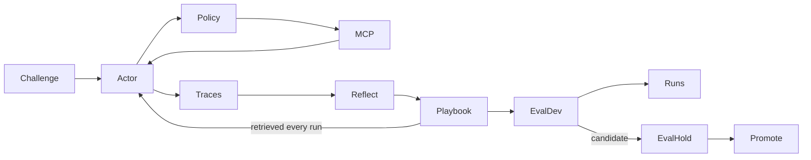

# Journeyman: pin the third-party the agent learns

Status: pin confirmed. Spec written. Fixture worker (`30hr-build-6`) and loop worker (`30hr-build-7`) spawned.

| Todo | Status |
|---|---|
| Confirm v1 pin: GitHub official MCP + seeded fixture repo | done |
| One-page spec: task family, DEV/hold-out, metrics, policy | done — see [SPEC.md](./SPEC.md) |
| Spawn fixture seeder | done — `30hr-build-6` Seed fixture |
| Spawn loop + UI builder | done — `30hr-build-7` Build loop UI |

## PS and idea

**Track:** Automated Agent Engineering. Judges want an agent that is given **third-party app access + a general task** and then **gets better** via learning loops: tool skill, self-reflection, growing memory, logic from *that app's data*, and a scoreboard (accuracy / reliability / cost / speed).

**Journeyman** is not another chatbot. It is an apprentice that:

1. Hits a real third-party app through MCP/API (policy-gated).
2. Does a **task family** (same tools, varied asks) — not one scripted workflow.
3. Writes traces, reflects, and stores a **playbook** (and later, cheap scripted paths).
4. Re-runs a **frozen DEV eval**; promote only after a **sealed hold-out**.
5. Shows v0 (empty memory) vs vN on the Runs timeline so the learning claim is visible.

The loop *shape* is enough; the **agent is empty** until we pin **one app, one task family, three numbers per run**.

We do **not** build red-team, a cost-router product, Context Gates as a subsystem, a second script DB, or a patch-agent for v1. Those stay stubs or fold into Policy YAML + one playbook.

## What learn gradually has to mean

A judge must see **the same task family** get cheaper and more correct because memory now contains **facts from the third-party**, not because we wrote a better prompt.

- **v0:** empty playbook. Actor explores tools, over-fetches, mis-labels, high tokens / high latency.
- **After N DEV runs:** playbook has *this workspace’s* schema/conventions.
- **vN:** same tasks, fewer tool calls, higher success, lower $ / tokens.
- **Hold-out:** new tasks on the **same** app, never used for reflection. If this does not move, we did not learn.

## Shortlist

| Target | Official MCP | Call |
|---|---|---|
| **GitHub** | `https://api.githubcopilot.com/mcp/` | **v1 pin** |
| Linear | `https://mcp.linear.app/mcp` | Stretch / v1.1 |
| Notion | `https://mcp.notion.com/mcp` | Strong alt |
| Stripe test mode | `https://mcp.stripe.com` | Only if payments demo |
| Slack | `https://mcp.slack.com/mcp` | No for 30h |
| Playwright | local | No for 30h |

Do not pin two MCPs in v1.

## v1 pin

Official GitHub MCP, policy-limited. Fixture repo we own and seed. Task family: repo triage / grounding.

See [SPEC.md](./SPEC.md) for labels, issues, PRs, DEV/hold-out tasks, metrics, and worker split.
